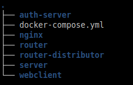

# docker-digitalstage

This repository is for running digital-stage (https://github.com/digital-stage) with docker containers. 

## For contributors

You shouldn't use the images inside this repository because the images are build with a git clone from 
the master branch, so you will always have a copy from the master branch only. Therefore only the 
docker-compose.yml is interesting for developers.  
Each repository at https://github.com/digital-stage has its own Dockerfile.  

If you want to contribute/develop first clone the repositories at https://github.com/digital-stage .
After that take the docker-compose.yml from this repository and put it inside your folder where you 
cloned the repositories.  
Your structure should look like this:

Building all images:  
`docker compose build`

Building a specific image  
`docker compose build <name>`  
e.g. `docker compose build server`

Running:
`docker-compose up -d`

The main entrypoint for the application is the web ui at localhost:3000 (TODO add nginx).  
If you start the application there won't be any user added. You could create an user via the web app at 
http://localhost:3000 or via a POST request:  
`curl -X POST -H "Content-Type: application/json" -d '{"name":"testuser","email":"test@test.tld","password":"Testtest@123"}' http://localhost:5000/signup
`  

The router needs credentials to register himself to the router-distributor. The router takes this from 
the env variables `EMAIL` and `PASSWORD`. These must match with the credentials you created before.

After that the router needs to be restarted with `docker-compose restart router`.  
To verify that a route was added either check the container logs or call GET `http://localhost:4020/routers` . 
The response should be a non empty array.

## TODO
- The containers are build for dev purposes. These are not production ready containers.
- Add nginx (also for cors issues).
- Change the docker build so that it won't clone each repository. Instead take the prebuild binaries.
- The webclient uses fetch, which uses ssl. Either disable ssl or uses a self signed certificate.
- Add ipv6 for the containers. The router uses ipv6, which is disabled inside the containers. (ipv6 must
be enabled in the docker daemon for usage).

